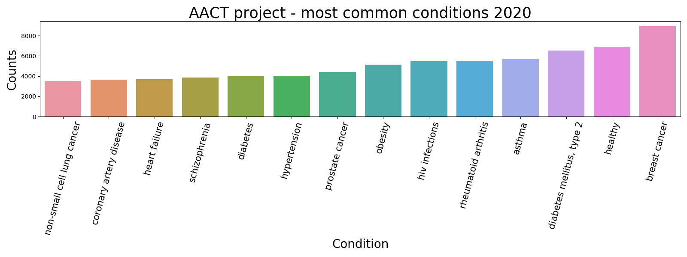
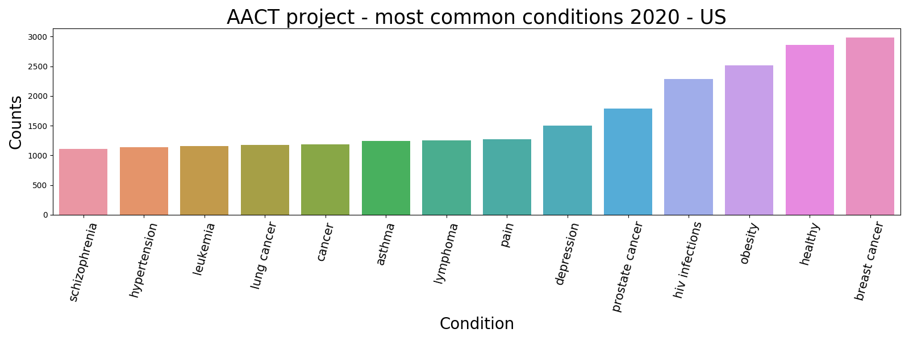

# AACT-Analysis
Visual exploration of the AACT dataset for 2020

CTTI has aggregated and restructured publicly available ClinicalTrials.gov data and made it available here as a relational database to facilitate analysis of the complete set of trials. This database is the Aggregate Analysis of ClincalTrials.gov (AACT).

By combining the two datasets "conditions" and "location_countries" inside the AACT database,
this project shows not only the most prevalent conditions globally but also per nation,
filtered by most represented countries.

